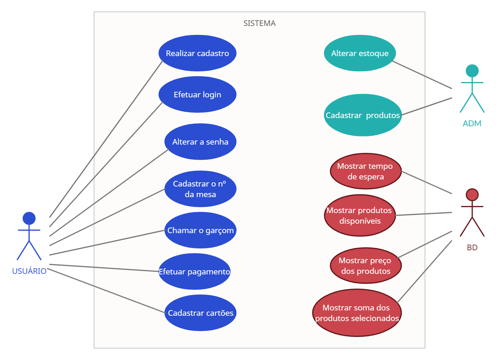

# Especificações do Projeto

Pré-requisitos: <a href="1-Documentação de Contexto.md"> Documentação de Contexto</a>

Definição do problema e ideia de solução a partir da perspectiva do usuário. É composta pela definição do  diagrama de personas, histórias de usuários, requisitos funcionais e não funcionais além das restrições do projeto.

Apresente uma visão geral do que será abordado nesta parte do documento, enumerando as técnicas e/ou ferramentas utilizadas para realizar a especificações do projeto

## Personas

| Juliana Souza      |                                    |                |
|--------------------|------------------------------------|----------------------------------------|
||**Idade:** 29 anos - **Ocupação:** Desenvovedora de Software, Dona de Casa |**Aplicativos:** Facebook, Whatsapp, Instagram.|
|**Motivações:** Juliana tem problemas em relação a dificuldade em si fazer um pedido em alguns lugares, pois a maioria de bares que frequenta estão sempre cheios, dificultando seus pedidos.  |**Frustrações:** Juliana não consegue realizar um pedido de forma fácil pois em alguns lugares não há organização em relação às filas dos caixas. |**Hobbies, História:** Juliana sempre foi dedicada em relação ao estudo/trabalho, encontrou sua paixão na tecnologia e durante sua faculdade unificou o trabalho ao seu dia a dia pois desde jovem tinha o sonho de morar sozinha.| 

| Nair Viana      |                                    |                |
|--------------------|------------------------------------|----------------------------------------|
||**Idade:** 63 anos - **Ocupação:** Aposentada, Dona de Casa |**Aplicativos:** Whatsapp.|
|**Motivações:**  Pelos ambientes normalmente cheios ou com falta de organização na hora de retirar os pedidos Nair não consegue fazer seus pedidos de forma rápida e acaba tendo que esperar por muito tempo pela sua comida. |**Frustrações:**  Por possuir hipoglicemia, Nair se vê em um beco sem saída quando quer comer em alguns restaurantes, pois sempre há uma demora na retirada e na preparação de seu pedido. |**Hobbies, História:** Por ser cultura de suas amigas sempre saírem para almoçar juntas aos sábados, Nair sempre teve que se preocupar em ter uma refeição pequena antes de sair para que não passe mal devido sua condição de saúde.|

| João Marques    |                                    |                |
|--------------------|------------------------------------|----------------------------------------|
||**Idade:** 42 anos - **Ocupação:** Dono do restaurante Comida Mineira.     |**Aplicativos:** Facebook, Whatsapp, LinkedIn, Instagram, Jornais.|
|**Motivações:** Visando garantir melhor qualidade de atendimento em seu restaurante, o restaurante de João visa o uso de comanda digital que facilita o gerenciamento dos pedidos.  |**Frustrações:** Devido a recentes reclamações do atendimento falho em seu restaurante João decidiu melhorá-lo e agilizá-lo, trazendo mais satisfação do cliente.|**Hobbies, História:** Gosta de passar o tempo livre se divertido com a família.|

| Clara Lima   |                                    |                |
|--------------------|------------------------------------|----------------------------------------|
||**Idade:** 19 anos - **Ocupação:** Estudante e garçonete em um bar local.     |**Aplicativos:**  Facebook, Instagram e WhatsApp.|
|**Motivações:** Clara começou a trabalhar como garçonete em um bar no período da noite para pagar sua faculdade. |**Frustrações:** Clara, por ser uma garçonete ainda sem experiência muitas vezes aca confundido os pedidos dos clientes.|**Hobbies, História:** Clara terminou o ensino médio e está se preparando para entrar na faculdade, e com o tempo tão corrido, procura sempre processos que agilizem suas atividades.|

| Milena Martins  |                                    |                |
|--------------------|------------------------------------|----------------------------------------|
||**Idade:** 40 anos - **Ocupação:** Trabalha em uma multinacional da área de siderurgia.   |**Aplicativos:**  Facebook, Whatsapp, LinkedIn, Instagram, Jornais.|
|**Motivações:**  Milena é vegetariana e não consome bebidas alcoólicas, porém quando vai ao happy hour de sua empresa os pedidos são feitos por uma pessoa apenas. |**Frustrações:** Quando sai com seus amigos acaba tendo que dividir a conta de forma igual, mesmo não consumindo bebidas alcoólicas ou comidas com carne.|**Hobbies, História:** Gosta de sair com os amigos nos finais de semana e tocar violão.|

## Histórias de Usuários

Com base na análise das personas forma identificadas as seguintes histórias de usuários:

|EU COMO... `PERSONA`| QUERO/PRECISO ... `FUNCIONALIDADE` |PARA ... `MOTIVO/VALOR`                 |
|--------------------|------------------------------------|----------------------------------------|
|Juliana Souza   | fazer meu pedido por app         | que não precise enfrentar filas grandes               |
|Nair Viana       | fazer meu pedido rápido                | que ele seja entregue o mais rápido possível |
|João Marques       | agilizar o atendimento dos meus clientes                | que os clientes saiam satisfeitos do restaurante |
|Clara Lima       | de uma maneira fácil de organizar os pedidos dos clientes                | que ela não se confunda ou atrase os pedidos |
|Milena Martins       | comodidade para fazer o seu próprio pedido                | sua conta fique separada das demais pessoas |
|Clara Lima       | autonomia para que os clientes façam o próprio pedido                | para que proporcione mais comodidade ao cliente |
|Milena Martins     | um cardápio bem organizado                  | consiga encontrar alimentos vegetarianos de forma prática |

## Modelagem do Processo de Negócio 

### Análise da Situação Atual

Apresente aqui os problemas existentes que viabilizam sua proposta. Apresente o modelo do sistema como ele funciona hoje. Caso sua proposta seja inovadora e não existam processos claramente definidos, apresente como as tarefas que o seu sistema pretende implementar são executadas atualmente, mesmo que não se utilize tecnologia computacional. 

### Descrição Geral da Proposta

Apresente aqui uma descrição da sua proposta abordando seus limites e suas ligações com as estratégias e objetivos do negócio. Apresente aqui as oportunidades de melhorias.

### Processo 1 – PROCESSO DE PEDIDOS

Hoje este processo é feito manualmente pelos atendentes e garçons, uma melhoria de qualidade e exclusão de erros seria a criação da aplicação seguindo os passos abaixo. Em seguida,segue descrito no padrão BPMN. 

## Indicadores de Desempenho

- Melhora no tempo de Atendimento 
- Redução dos erros em pedidos
- Facilidade em conferencia de valores
- Quantidade de Reclamações dos clientes
- Quantidade de Reclamações dos atendentes/garçons.

Usar o seguinte modelo: 

Obs.: todas as informações para gerar os indicadores devem estar no diagrama de classe a ser apresentado a posteriori. 

## Requisitos

As tabelas que se seguem apresentam os requisitos funcionais e não funcionais que detalham o escopo do projeto. Para determinar a prioridade de requisitos, aplicar uma técnica de priorização de requisitos e detalhar como a técnica foi aplicada.

### Requisitos Funcionais

|ID    | Descrição do Requisito  | Prioridade |
|------|-----------------------------------------|----|
|RF-001| O aplicativo deve permirtir cadastrar os produtos do estabelecimento. | ALTA |
|RF-002| O aplicativo deve mostrar em tempo real o tempo de espera do pedido ao cliente. | ALTA |
|RF-003| O aplicativo deve mostrar todas as opções do cardápio ao cliente. | ALTA |
|RF-004| O aplicativo deve mostrar valores dos produtos | ALTA |
|RF-005| O aplicativo deve somar todo o pedido do cliente | MÉDIA |
|RF-006| O aplicativo deve permitir realizar o pagamento por meio de pix, cartão de credito  e dinheiro | ALTA |
|RF-007| O Aplicativo deve chamar um garçom a mesa do cliente | MÉDIA |
|RF-008| O aplicativo deve computar o número da mesa do cliente | ALTA |
|RF-009| O aplicativo deve parmitir o cadastro de usuários | ALTA |
|RF-010| O aplicativo deve permitir que o usuário logue em sua conta | ALTA |
|RF-011| O aplicativo deve permitir que o usuário consiga alterar dados da conta | ALTA |
|RF-012| O aplicativo deve permitir que o usuário cadastre cartões para pagamento | ALTA |
|RF-013| O aplicativo deve permitir alterar o estoque de produtos | ALTA |

### Requisitos não Funcionais

| ID      | Descrição do Requisito                                       | Prioridade |
| ------- | ------------------------------------------------------------ | ---------- |
| RNF-001 | O sistema de ser feito usando práticas de UX e IxD           | ALTA       |
| RNF-002 | O sistema deve ser disponibilizado publicamente no GitHub.   | ALTA       |
| RNF-003 | O sistema deve apresentar baixo tempo de resposta nas requisições. | ALTA       |
| RNF-004 | O sistema deve apresentar um filtro para pesquisas.          | ALTA       |
| RNF-005 | O sistema deve ser implementado em uma linguagem para dispositivo móvel | ALTA       |
| RNF-006 | O sistema deve ser responsivo e compatível com os principais navegadores. | ALTA       |

## Restrições

O projeto está restrito pelos itens apresentados na tabela a seguir.

| ID   | Restrição                                                    |
| ---- | ------------------------------------------------------------ |
| 01   | O projeto deverá ser entregue até o final do semestre        |
| 02   | O Projeto deve ser desenvolvido em uma linguagem para uma aplicação móvel |

## Diagrama de Casos de Uso

| ATOR   | DESCRIÇÃO                                                   |
| ---- | ------------------------------------------------------------ |
| Usuário | Pessoa que irá utilizar o aplicativo para fazer o pedido no restaurante|
| BD | Banco de dados que deve armazenar e buscar as informações dos usuários, dos produtos cadastrados e dos pedidos realizados. |
| ADM | Pessoa do restaurante responsável por administrar os pedidos |

| CASO DE USO   | DESCRIÇÃO                                                   |RF| 
| ---- | ------------------------------------------------------------ |--- |
| Realizar cadastro de usuário | 	O usuário deve conseguir realizar um cadastro na aplicação|RF-009|
| Efetuar login na aplicação | O usuário deve conseguir realizar um login na aplicação com suas credenciais cadastradas |RF-010|
| Alterar a senha | O usuário deve conseguir alterar a sua senha |RF-011|
| Realizar cadastro de cartões | O usuário deve conseguir realizar o cadastro de cartões |RF-012|
| Realizar cadastro de produtos | O administrador deve conseguir realizar o cadastro de produtos disponíveis |RF-001|
| Alterar estoque | O administrador deve conseguir alterar o estoque de produtos |RF-013|
| Cadastrar o número da mesa | O usuário deve conseguir cadastrar o número da mesa|RF-008|
| Chamar o garçom | O usuário deve conseguir chamar o garçom pelo app |RF-007|
| Realizar pagamento | O usuário deve conseguir pagar seu pedido |RF-006 |
| Mostrar tempo de espera | O aplicativo deve mostrar o tempo de espera |RF-002|
| Mostrar produtos disponíveis | O aplicativo deve mostrar os produtos disponíveis  |RF-003|
| Mostrar preço dos produtos | O aplicativo deve mostrar o preço dos produtos disponíveis |RF-004|
| Mostrar soma dos produtos selecionados | O aplicativo deve mostrar a soma dos produtos selecionados|RF-005|

## Representação visual

*Figura 1 – Diagrama de Casos de Uso*

# Matriz de Rastreabilidade

A matriz de rastreabilidade é uma ferramenta usada para facilitar a visualização dos relacionamento entre requisitos e outros artefatos ou objetos, permitindo a rastreabilidade entre os requisitos e os objetivos de negócio. 

A matriz deve contemplar todos os elementos relevantes que fazem parte do sistema, conforme a figura meramente ilustrativa apresentada a seguir.

> **Links Úteis**:
> - [Artigo Engenharia de Software 13 - Rastreabilidade](https://www.devmedia.com.br/artigo-engenharia-de-software-13-rastreabilidade/12822/)
> - [Verificação da rastreabilidade de requisitos usando a integração do IBM Rational RequisitePro e do IBM ClearQuest Test Manager](https://developer.ibm.com/br/tutorials/requirementstraceabilityverificationusingrrpandcctm/)
> - [IBM Engineering Lifecycle Optimization – Publishing](https://www.ibm.com/br-pt/products/engineering-lifecycle-optimization/publishing/)

# Gerenciamento de Projeto

De acordo com o PMBoK v6 as dez áreas que constituem os pilares para gerenciar projetos, e que caracterizam a multidisciplinaridade envolvida, são: Integração, Escopo, Cronograma (Tempo), Custos, Qualidade, Recursos, Comunicações, Riscos, Aquisições, Partes Interessadas. Para desenvolver projetos um profissional deve se preocupar em gerenciar todas essas dez áreas. Elas se complementam e se relacionam, de tal forma que não se deve apenas examinar uma área de forma estanque. É preciso considerar, por exemplo, que as áreas de Escopo, Cronograma e Custos estão muito relacionadas. Assim, se eu amplio o escopo de um projeto eu posso afetar seu cronograma e seus custos.

## Gerenciamento de Tempo

Com diagramas bem organizados que permitem gerenciar o tempo nos projetos, o gerente de projetos agenda e coordena tarefas dentro de um projeto para estimar o tempo necessário de conclusão.

| Data| Etapa |
| :---        | :---   |
| 11/08    |   1ª ETAPA: Concepção, Proposta de Solução e Início da Elaboração do Projeto da Solução: Definição    |
| 09/10     |   2ª ETAPA: Continuidade da Elaboração do Projeto da Solução e Início do Desenvolvimento    |
| 30/10    |  3ª ETAPA: Continuidade do Desenvolvimento da Solução: Desenvolvimento da aplicação móvel (Parte 1)    |
| 27/11	     |  4ª ETAPA: Continuidade do Desenvolvimento da Solução: Desenvolvimento da aplicação móvel (Parte 2)    |
| 07/12     |  5ª ETAPA: Diagnóstico, entrega da solução e apresentação    |

O gráfico de Gantt ou diagrama de Gantt também é uma ferramenta visual utilizada para controlar e gerenciar o cronograma de atividades de um projeto. Com ele, é possível listar tudo que precisa ser feito para colocar o projeto em prática, dividir em atividades e estimar o tempo necessário para executá-las.

## Gerenciamento de Equipe

O gerenciamento adequado de tarefas contribuirá para que o projeto alcance altos níveis de produtividade. Por isso, é fundamental que ocorra a gestão de tarefas e de pessoas, de modo que os times envolvidos no projeto possam ser facilmente gerenciados. 

## Gestão de Orçamento

O processo de determinar o orçamento do projeto é uma tarefa que depende, além dos produtos (saídas) dos processos anteriores do gerenciamento de custos, também de produtos oferecidos por outros processos de gerenciamento, como o escopo e o tempo.

| Recursos Necessários | Recursos Necessários	(R$) |
| :---        |    :----:   |
| Recursos Humanos     |  	R$90.000,00    |
| Hardware    |  	R$18.000,00   |
| Software    |   R$00,00  |
| Celular    |   	R$4.500,00 |
| Total    |   	R$112.500,00 |

- Serão 6 membros Analistas Juniores com salário de R$2500,00 por mês.
- Serão 6 Notebooks i5 8gigas de ram 256 SSD R$3000,00 cada.
- Serão 6 Celulares Samsung A11 R$750,00 cada.
- Softwares usaremos free to use ou opensource.

