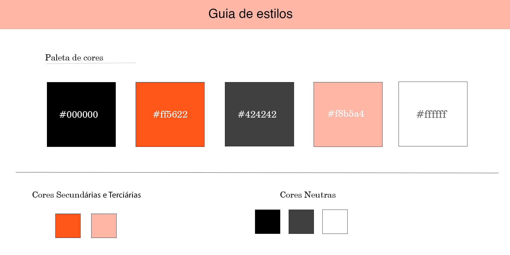
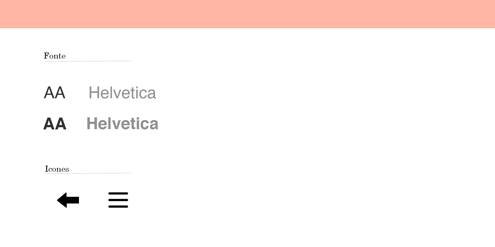

# Template Padrão da Aplicação

## Guia de Estilos

Antes de definir o template da aplicação, foi necessário definir uma guia de estilos com todos os padrões que serão utilizados durante o desenvolvimento do projeto. Estão detalhados nos itens a seguir:

### Paleta de Cores

A paleta de cores definida para nosso sistema conta com 5 cores que reflete uma certa extravagancia e muita personalidade para o usuário.

## Tipografia e icones

 Seguem as seguintes definições:

