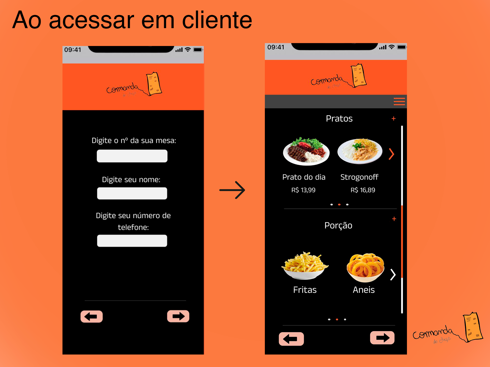

# Template Padrão da Aplicação

## Tela - LandingPage / Login 

A tela de login ou Landing Page, permite o colaborador e o cliente acessem seu respectivos objetivos  obtendo acesso as demais atividades.

Figura 1

## Tela -  Acesso aos clientes

Nesta tela temos o primeiro acesso dos clientes, sendo necessário algumas informações pessoais do cliente, logo após preenchidas serão direcionados ao menu de opções (Cardapio) do local.

Figura 2

## Tela - Solicitando Pedidos

Os usuário são direcionados para está página logo após selecionar seus produtos, sendo necessário escolher a quantidade desejada, depois de todo o processo será direcionada a uma mensagem de confirmação do pedido.

Figura 3

## Tela - Fechamento de pedidos

Para fechar a conta da mesa, basta clicar no menu hamburguer e selecionar a opção "Fechar conta". O usuário será levado para uma página aonde será apresentado as formas de pagamento dentre elas temos Cartão de Credito, PIX e pagamento direto no caixa.

 Figura 4

## Tela - Fechamento de pedidos *(Cartão de Credito)*

Os usuário que selecionarem a opção de pagamento por cartão de credito  serão direcionados para página abaixo, sendo solicitado os dados do cartão que depois de inseridos corretamente e selecionado a opção de continuar, será exibido uma mensagem de confirmação de pagamento para o usuário.

Figura 5

## Tela - Fechamento de pedidos (PIX)

Seguindo a mesma lógica de pagamento por cartão de credito temos as paginas direcionadas a pagamento por PIX sendo utilizado o método de QR Code, sendo possível também pagar com o Copie e cole

 Figura 6

## Tela -  Login e Homepage Colaboradores

 Ao selecionar a opção "Funcionário" como apresentado na figura 1, será exibido as seguintes paginas sendo necessário  digitar o login e senha para acesso. após inseridos o usuário terá acesso as funcionalidades,

Figura 7

## Tela -  Cadastro de usuários

 Ao selecionar o menu Hamburguer aparecera a opção de "Cadastrar Usuários" para fazer cadastramento de novos colaboradores. Ao colocar os dados como nome de usuário e a senha basta clicar em salvar  e pronto um novo usuário foi cadastrado.

Figura 8

## Tela -  Visualização de pedidos

Para monitorar os pedidos basta na página inicial colocar o número da mesa e acompanhar os pedidos.

Figura 9

## Protótipo

Para facilitar ainda mais o entendimento deixo o link do protótipo: 

https://www.figma.com/proto/Ldgh6dhVdV0199YAUMj8vU/Comanda-do-chefe?node-id=0%3A1&scaling=scale-down&page-id=0%3A1&starting-point-node-id=8%3A16&show-proto-sidebar=1

## FireBase - Passo a passo

Passo 1

.png)

Passo 2

.png)

Passo 3

.png)

Passo 4

.png)

Tela Usuario Cadastrado com Sucesso

Tela Comanda

Tela Comanda Com Produto

Tela Criação Pedido

Tela Lista de Produtos

Tela de Login

Tela de Pagamento

Tela Caixa

Tela Pagamento Cartão

Tela Pagamento Cartão Finalizado

Tela Pedido Finalizado

Tela Produto

